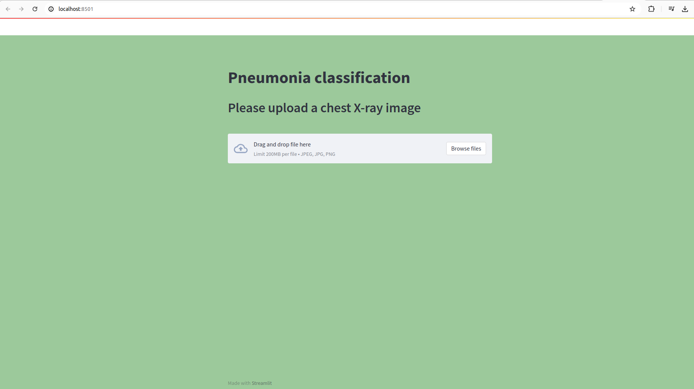
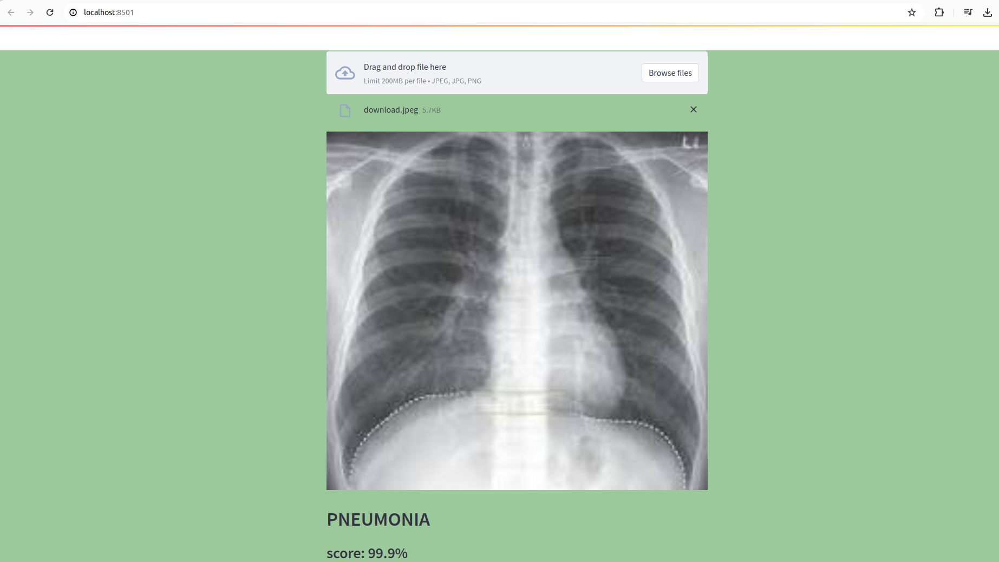

# web-app-python-streamlit-pneumonia-classifier-computer-vision
using: keras, tensorflow, Pillow, streamlit, numpy

# data
Data: https://data.mendeley.com/datasets/rscbjbr9sj/2

License: CC BY 4.0

Citation: http://www.cell.com/cell/fulltext/S0092-8674(18)30154-5

# model
A pneumonia classifier was used to classify X-RAY images into {PNEUMONIA, NORMAL}.

The model was trained by Felipe (aka computervisioneng) using the data provided in the next section and following this step by step tutorial on how to train an image classifier with Teachable Machine.

# how to run 
in your terminal: >>>streamlit run main.py

# examples:

